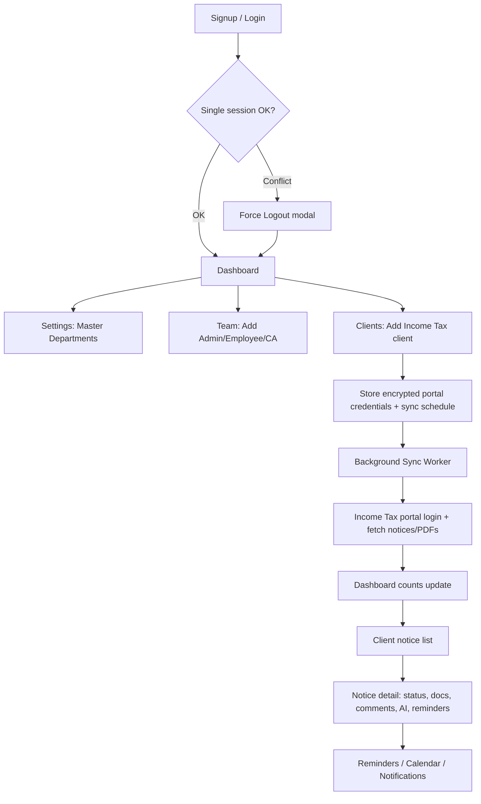

# Income Tax Notice SaaS — Application Flow

**Source:** `.cursor/reference/screen-capture.mp4` (~4 min 16 sec) + prior NoticeCPC screenshots  
**Product reference:** [noticecpc.com](https://www.noticecpc.com/) (Figment Global Solutions)  
**Phase 1 scope:** Income Tax module first  
**Stack:** Angular · ASP.NET Core · Azure · Azure SQL  

---

## 1. Video Analysis Summary

| Item | Finding |
|------|---------|
| Duration | ~255 seconds |
| App | NOTICE CPC (logged in as VANSH SHARMA / NDTS INDIA) |
| Primary path | Dashboard → Clients → Income Tax notices → Notice detail |
| Also visited | Team (Add Member), Settings (Profile, Master, Usage & Limits), Reminders, Need Help |
| Not fully shown | Calendar grid, portal OTP handoff, live sync run |

The recording confirms a **client → notices → notice detail** workflow with **credential-based sync**, **sync credits**, **single-session timer**, and **master data** (Department / Designation / Roles).

---

## 2. Chronological Flow (From Video)

```text
1. Splash / loading (NOTICE CPC — Powered By Figment Global Solutions)
2. Dashboard (/dashboard)
3. Clients → Income Tax client details (/details?data=...)
   → All Notices (21) | Outstanding Demand (1)
   → Notices / Direct Orders / Manual Notices / Case Status
   → Expand row + row actions (View Details, Update Status, Edit Row)
4. Notice Details (full workspace + AI + attachments + timeline + comments)
5. Team (/team) → Add Team Member modal (Departments: Accounting, GST, Income Tax, TDS)
6. Settings → Profile (/setting/profile)
7. Settings → Master → Department (/setting/mastersetting/department)
8. Clients → Income Tax list (/client/incometax) → Add Client modal
9. Reminders (/reminders)
10. Need Help? → Raise a Ticket modal
11. Usage & Limits modal (Assesse + Sync Credit quotas)
```

---

## 3. Global Shell (Every Screen)

### Top navigation

| Item | Notes |
|------|--------|
| Logo | NOTICE CPC |
| Menu | Dashboard · Team · Clients · Calendar · Reminders · Need Help? |
| Session timer | Countdown (e.g. 09:56 → 00:52) — idle / single-session TTL |
| Sync credits | Header badge + sidebar (e.g. **135**) |
| Theme | Light / dark (sun icon) |
| Notifications | Bell with unread badge |
| Profile | Initials avatar (VS) → settings / logout |

### Single-session rule

- One active session per user account.
- Login elsewhere → **Session Already Active** modal (IP, login time, last activity).
- Actions: **Check Again** | **Force Logout**.
- Tip: *Don't share credentials. Add team members instead.*

---

## 4. Module Specs (Build These)

### 4.1 Dashboard — `/dashboard`

**Filters:** Module (`Income Tax`) · Period (`Monthly`)

**Summary cards**

| Card | Example from video |
|------|--------------------|
| Total Clients | 1 (+1 this month) |
| Total Team Members | 1 (Active 1 \| Inactive 0) |
| Total Notices | 21 (21 Self \| 0 Other PAN/TAN) |

**Manage Tasks**

| Bucket | Count | Color cue |
|--------|-------|-----------|
| New notices | 3 | Blue |
| Ongoing notices | 2 | Purple |
| Notices closed | 14 | Green |
| Overdue notices | 2 | Red |

**Insights (Phase 2 / Coming Soon)**

- PAN/TAN-Wise Notice Summary
- Upcoming Due Dates

**Right sidebar**

- Profile card (name, email)
- Sync Credits balance
- Quick links: **Income Tax** · **ITR** (NEW) · **GST** · **Insight Report**
- New Additions feed
- Mobile app promo (optional)

---

### 4.2 Team — `/team`

**Title:** Manage Team — *Check Team progress and status*

**Role tabs:** Admin · Employee · CA  

**Toolbar:** Search by name · Filter · List / Grid · Show Grand Total · **+ Add Team**

**Table columns**

| Name | Designation | Department | Email | Phone No |

**Add Team Member modal**

| Field | Type |
|-------|------|
| First Name | text |
| Last Name | text |
| Email | text |
| Phone No | text |
| Designation | dropdown |
| Role | dropdown |
| Department | dropdown: Accounting, GST, Income Tax, TDS |
| Actions | Cancel · **Add Member** |

---

### 4.3 Clients — Income Tax — `/client/incometax`

**Toolbar:** Search PAN · Filter · **Sync** · **Add Client** · All IT Notices  

**Client list columns (observed)**

| Column | Example |
|--------|---------|
| PAN-TAN / Client Name | MARSHAL QUARRIES AND GRANITES… |
| CA PAN | NA |
| User Name | Portal user / PAN |
| Last Sync On | e.g. 11 Jul — 12:11 PM |
| Status | ACTIVE (green) |
| Proceedings | count / status |
| Sync Category | Daily / Weekly / … |
| Next Sync Available | timestamp |

**Add Client modal (critical for sync)**

| Field | Options / notes |
|-------|-----------------|
| Category | Income Tax · Insight Report · GST |
| Sync Type | **Daily · Weekly · Midweek · Fortnightly · Monthly** |
| Username | Income Tax portal User ID |
| Password | with show/hide |
| Warning | *Please ensure to enter all details correctly.* |
| Actions | Cancel · **Proceed** |

> Adding a client stores encrypted credentials + schedule. Portal fetch runs as a background sync job (not instant “magic API”).

---

### 4.4 Client Income Tax Notices — `/details?data=...`

**Breadcrumb:** Home → Clients → Income Tax → `{PAN}` → `{Client Name}` · **Active** · Back · **Assign**

**Primary tabs**

| Tab | Example count |
|-----|---------------|
| All Notices | 21 |
| Outstanding Demand | 1 |

**Sub-tabs under All Notices**

| Sub-tab | Example |
|---------|---------|
| Notices | 21 (or 20) |
| Direct Orders | 1 |
| Manual Notices | 0 |
| Case Status | 0 |

**Toolbar:** Search Document Reference Id · Filter · Proceeding Status · Export Excel/PDF · Settings · List/Grid  

**Notice table columns**

| Column | Notes |
|--------|--------|
| Notice Section / Description | FYI / FYA tags; section + description |
| CA PAN | often NA |
| DIN / Doc Ref Id | hyperlink |
| FY | e.g. 2014-15, 2021-22 |
| Notice Date | date |
| Due Date | date or NA |
| Section | SELF / other |
| Status | Order · Replied · Open · Overdue (color pills) |
| Notice Doc | PDF icon |
| Actions | ⋮ menu |

**Expanded row fields (observed)**

- Doc Ref Id, Header Seq Id  
- Response Submitted On  
- Proceeding Open Date, Proceeding Closure Date  
- Party PAN, Notice Description, Proceeding Name  
- Proceeding Type (e.g. ITBA)  
- CA NAME, Assessment Year  
- **Fetch Date** (when sync imported the notice)

**Row menu:** View Details · Update Status · Edit Row  

**Footer:** Showing # N · Show Grand Total  

---

### 4.5 Notice Details

**Header**

- Title: Notice Details  
- Proceeding Id · Section  
- Updated Status (e.g. Open) · Overdue on · Comments count  
- CTA: **Get AI Assistance — Analyze your notice with Notice AI**

**Action strip**

| Action | Purpose |
|--------|---------|
| Case Status | Refresh / check portal case status |
| Update Status | Change workflow status |
| Set Reminder | Create reminder |

**Metadata grid**

| Proceeding Name | PAN | Assessee Name |
| Financial Year | Served On | Response Submitted On |
| Document Reference ID | Notice Section | Description |

**Documents**

- Notice Attachments (list / empty state)
- **Attach Reply Documents** categories:
  - Bank account statement  
  - Transaction statement  
  - Evidence with sources for cash deposits  
  - KYC  
  - Others  
- **Submit**

**Right panel**

- Status Timeline (history of status changes)
- Comments (list + “Leave a comment” + Comment button)

---

### 4.6 Reminders — `/reminders`

**Title:** All Reminders — *View all reminders and stay on top of your tasks!*  
**Breadcrumb:** Home → Client → Reminders · Back to Dashboard  

**Tabs:** Pending (count) · Done (count)  

**Search:** field type dropdown (Proceeding id) · Enter Proceeding id · Priority filter  

**Table columns**

| Segment | Proceeding id/Ref id | Pan/GSTIN | Priority | Description | Due On |

---

### 4.7 Settings

**Shell:** Account & Security Settings  
**Sidebar:** Profile · Preferences · Master · Security Settings  

#### Profile — `/setting/profile`

| Section | Fields |
|---------|--------|
| Profile | Name, Username, Company Name, Role, Company Type (CA / Corporate / Others) |
| Personal | Email, Contact Number, GSTIN, Address Line 1, Address Line 2 |
| Mode | Read-only until **Edit** |

#### Master — `/setting/mastersetting/department`

Tabs: **Department** · Designation · Roles  

Department table example:

| Department | Created at |
|------------|------------|
| Accounting | 06 Jul 2026 |
| GST | 06 Jul 2026 |
| Income Tax | 06 Jul 2026 |
| TDS | 06 Jul 2026 |

Action: **+ Add Department**

#### Usage & Limits (modal)

| Item | Example |
|------|---------|
| Plan | Demo Plan · Active |
| Reg / Expiry | 06-Jul-2026 → 21-Jul-2026 · 9 days remaining |
| Assesse Limit | 3 / 5 (2 remaining) |
| Sync Credit | 15 / 150 used · **135 remaining** |
| Modules enabled | Income-Tax · Insight-Report · GST · ITR |
| Note | Limits reset automatically on schedule |

#### Need Help? → Raise a Ticket

Modal with contact info + form (name, email, phone, description, captcha) · **Raise Ticket**

---

## 5. End-to-End Business Flow (Income Tax)



### Sync frequency (from Add Client UI)

`Daily` · `Weekly` · `Midweek` · `Fortnightly` · `Monthly`

### Sync credits (billing constraint)

- Each sync consumes credits from plan quota.  
- Header shows remaining credits.  
- Block or warn when credits / assessee limit exhausted.

### Portal login note

- Default Income Tax login (no e-Filing Vault 2FA) supports unattended sync best.  
- If vault OTP is enabled, sync must pause for user-assisted OTP (fallback).

---

## 6. Notice Status Model

Observed pills: **Open** · **Replied** · **Order** · **Overdue**  

Recommended internal set (align with product blueprint):

```text
New → Open → In Progress → Replied → Closed
                ↘ Order Received → Appeal
Overdue = system flag when DueDate passed and not closed
```

---

## 7. Suggested Routes (Angular)

| Route | Screen |
|-------|--------|
| `/signup` | Signup |
| `/login` | Login + session conflict modal |
| `/dashboard` | Dashboard |
| `/team` | Manage Team |
| `/client/incometax` | Income Tax clients |
| `/details` | Client notices (encode client context) |
| `/notices/:id` | Notice detail |
| `/calendar` | Calendar |
| `/reminders` | Reminders |
| `/setting/profile` | Profile |
| `/setting/mastersetting/department` | Master departments |
| `/setting/mastersetting/designation` | Designations |
| `/setting/mastersetting/roles` | Roles |
| `/setting/security` | Security settings |
| `/help` | Raise ticket |

---

## 8. Data Entities (Azure SQL — Phase 1)

- Organizations, Users, OrganizationMembers  
- Departments, Designations, Roles  
- Clients, PortalCredentials, SyncSchedules  
- SyncJobs, SyncJobLogs, SyncCreditLedger, Subscriptions  
- Notices, NoticeDocuments, NoticeStatusEvents  
- NoticeComments, NoticeAssignments, Reminders, Notifications  
- UserSessions, AuditLogs  

**Unique key suggestion:** `(OrganizationId, Pan, ProceedingId, DocRefId)` for notices.

---

## 9. API Groups (ASP.NET Core)

| Area | Examples |
|------|----------|
| Auth | login, force-logout, session-status, refresh |
| Dashboard | `GET /api/v1/dashboard/summary?module=IncomeTax&period=Monthly` |
| Team | list, invite/add member |
| Clients | list IT clients, add client + credentials, trigger sync |
| Notices | list by client/tab, detail, status, comments, documents |
| Master | CRUD department / designation / roles |
| Billing | usage & limits, sync credits |
| Reminders | list pending/done, create from notice |

Sensitive payloads (credentials, PAN, notices): TLS + optional RSA/AES envelope (`API_ENCRYPTION_DESIGN.md`).

---

## 10. Azure Architecture Fit

| Concern | Service |
|---------|---------|
| Angular SPA | Static Web Apps / Blob + CDN |
| API | App Service / Container Apps |
| DB | Azure SQL |
| Sessions | Redis (single session + timer) |
| Secrets | Key Vault |
| Sync queue | Service Bus |
| Sync workers | Container Apps (Playwright) |
| PDFs | Blob Storage + SAS URLs |
| Monitoring | Application Insights |

**Traffic:** Angular + .NET + Azure SQL handle large dashboard/API load well.  
**Bottleneck:** portal sync workers — scale separately from the API.

---

## 11. Phase 1 Build Order

| Sprint | Deliverable |
|--------|-------------|
| 1 | Auth, single session, session timer, main shell |
| 2 | Dashboard summary + task cards |
| 3 | Master (Department/Designation/Roles) + Team |
| 4 | Clients list + Add Client (credentials + sync type) |
| 5 | Notice list tabs + expandable row + detail page (manual upload first) |
| 6 | Sync worker for Income Tax (password-only accounts) |
| 7 | Reminders, notifications, Usage & Limits |

**Go/No-Go before Sprint 6:** Playwright login on one PAN (vault off) → fetch notices + PDF.

---

## 12. Out of Scope for Phase 1

- Full GST / ITR / Insight Report modules (keep nav stubs or hide)
- Mobile app
- Calendar polish (route can exist as stub)
- AI notice analyzer (optional Phase 1.5)
- Live portal OTP automation without human assist

---

## 13. Acceptance Criteria (Match Video)

- [ ] Dashboard shows clients, team, notices, and New/Ongoing/Closed/Overdue buckets  
- [ ] Add Income Tax client with category, sync type, username, password  
- [ ] Client notice list with Notices / Direct Orders / Manual / Case Status  
- [ ] Notice detail with metadata, PDF, reply uploads, status, timeline, comments  
- [ ] Team Add Member with department Income Tax / GST / TDS / Accounting  
- [ ] Master Departments CRUD  
- [ ] Session timer + one active session  
- [ ] Sync credits visible; Usage & Limits modal shows Assesse + Sync Credit quotas  

---

## 14. Related Documents

- `PRODUCT_BLUEPRINT.md` — MVP modules and statuses  
- `NOTICE_SAAS_WORKFLOW_AND_STACK.md` — portal sync model and scale  
- `API_ENCRYPTION_DESIGN.md` — encrypted API envelope on Azure  

---

*Generated from analysis of `.cursor/reference/screen-capture.mp4` frames (interval + scene detection) and prior UI captures.*
